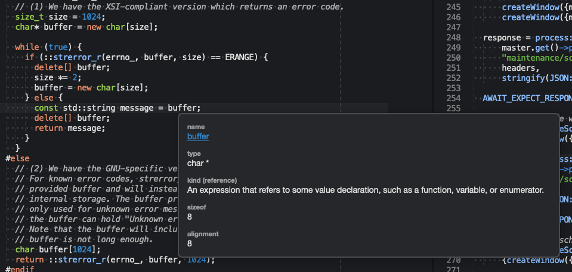
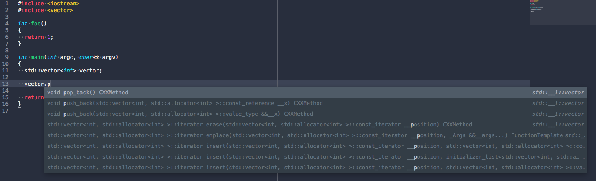
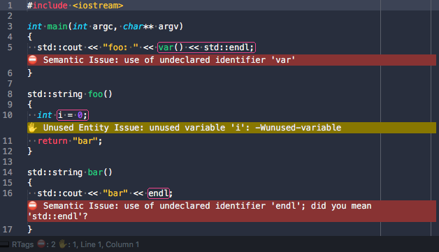

```
      ___       ___          ___          ___          ___
     /\  \     /\  \        /\  \        /\  \        /\  \
    /::\  \    \:\  \      /::\  \      /::\  \      /::\  \
   /:/\:\  \    \:\  \    /:/\:\  \    /:/\:\  \    /:/\ \  \
  /::\~\:\  \   /::\  \  /::\~\:\  \  /:/  \:\  \  _\:\~\ \  \
 /:/\:\ \:\__\ /:/\:\__\/:/\:\ \:\__\/:/__/_\:\__\/\ \:\ \ \__\
 \/_|::\/:/  //:/  \/__/\/__\:\/:/  /\:\  /\ \/__/\:\ \:\ \/__/
    |:|::/  //:/  /          \::/  /  \:\ \:\__\   \:\ \:\__\
    |:|\/__/ \/__/           /:/  /    \:\/:/  /    \:\/:/  /
    |:|  |                  /:/  /      \::/  /      \::/  /
     \|__|                  \/__/        \/__/        \/__/
      ___          ___          ___          ___                    ___                 ___
     /\__\        /\  \        /\  \        /\  \                  /\__\               /\__\
    /:/  /       /::\  \      |::\  \      /::\  \                /:/ _/_       ___   /:/ _/_
   /:/  /       /:/\:\  \     |:|:\  \    /:/\:\__\              /:/ /\__\     /\__\ /:/ /\__\
  /:/  /  ___  /:/  \:\  \  __|:|\:\  \  /:/ /:/  /___     ___  /:/ /:/ _/_   /:/  //:/ /:/ _/_
 /:/__/  /\__\/:/__/ \:\__\/::::|_\:\__\/:/_/:/  //\  \   /\__\/:/_/:/ /\__\ /:/__//:/_/:/ /\__\
 \:\  \ /:/  /\:\  \ /:/  /\:\~~\  \/__/\:\/:/  / \:\  \ /:/  /\:\/:/ /:/  //::\  \\:\/:/ /:/  /
  \:\  /:/  /  \:\  /:/  /  \:\  \       \::/__/   \:\  /:/  /  \::/_/:/  //:/\:\  \\::/_/:/  /
   \:\/:/  /    \:\/:/  /    \:\  \       \:\  \    \:\/:/  /    \:\/:/  / \/__\:\  \\:\/:/  /
    \::/  /      \::/  /      \:\__\       \:\__\    \::/  /      \::/  /       \:\__\\::/  /
     \/__/        \/__/        \/__/        \/__/     \/__/        \/__/         \/__/ \/__/
```


# About

Sublime Text 3 C/C++ code completion, navigation plugin. It is based on [RTags](https://github.com/Andersbakken/rtags).

This is a fork of the original [sublime-rtags](https://github.com/rampage644/sublime-rtags) by Sergei Turukin. New features have been added and merging those back into the original sublime-rtags has become a bottleneck this fork avoids.

# Installation

Make sure you installed RTags:

    git clone https://github.com/Andersbakken/rtags
    cd rtags
    mkdir build && cd build && cmake ..
    make install

### Via Package Control (not available yet!)

This fork is currently not available via PackageControl.

### Manually

    cd <sublime-text-Packages-dir>
    git clone https://github.com/tillt/RTagsComplete

# Features

## Symbol navigation (Goto definition/declaration)

## Find usages (Find symbol references, Find virtual function re-implementations)

## Symbol information



## Code completion



## File re-indexing results after save and idle timeout - shows errors and warnings inline



# Usage

It is an unstable plugin. There are a number of limitations which may or may not apply to your setup:

* You may have to run `rdm` daemon manually. Better run it before Sublime starts, because plugin creates persistent connection to daemon
* There is no `rdm`'s project management yet. So it's your responsibility to setup project, pass compilation commands (with `rc --compile gcc main.c` or `rc -J`). For more info see [LLVM codebase](http://clang.llvm.org/docs/JSONCompilationDatabase.html), [rtags README](https://github.com/Andersbakken/rtags/blob/master/README.org), [Bear project](https://github.com/rizsotto/Bear/blob/master/README.md).
* It is recommended to install [rtags via homebrew](http://braumeister.org/repos/Homebrew/homebrew-core/formula/rtags) and then follow the instructions on how to run rdm

### Typical work-flow
- Make sure `rdm` is active
  - linux
    - TBD
  - windows
    - TBD
  - macOS
    - via homebrew
    ```bash
    $ brew services start rtags
    ==> Successfully started `rtags` (label: homebrew.mxcl.rtags)

    $ brew services list
    Name           Status  User Plist
    [..]
    rtags          started till /Users/till/Library/LaunchAgents/homebrew.mxcl.rtags.plist
    [..]
    ```

    - via launch-control directly

    ```bash
    $ launchctrl start /Users/till/Library/LaunchAgents/homebrew.mxcl.rtags.plist
    ```

    ```xml
    <?xml version="1.0" encoding="UTF-8"?>
    <!DOCTYPE plist PUBLIC "-//Apple//DTD PLIST 1.0//EN" "http://www.apple.com/DTDs/PropertyList-1.0.dtd">
    <plist version="1.0">
    <dict>
      <key>Label</key>
      <string>homebrew.mxcl.rtags</string>
      <key>ProgramArguments</key>
      <array>
        <string>/usr/local/Cellar/rtags/2.14_1/bin/rdm</string>
        <string>--verbose</string>
        <string>--launchd</string>
        <string>--inactivity-timeout=300</string>
        <string>--log-file=/usr/local/var/log/rtags.log</string>
      </array>
      <key>Sockets</key>
      <dict>
        <key>Listener</key>
        <dict>
          <key>SockPathName</key>
          <string>/Users/till/.rdm</string>
        </dict>
      </dict>
    </dict>
    </plist>
    ```

- Obtain a _JSON compilation database_ from the build-chain of your project
  - via [Build EAR](https://github.com/rizsotto/Bear)
  ```
  $ make clean
  $ bear make -j6
  ```
  - via cmake
  ```
  $ cmake -DCMAKE_EXPORT_COMPILE_COMMANDS=1 /path/to/src
  ```

 - Supply `rdm` with the _JSON compilation database_ via `rc -J` or several `rc -c` calls.
  ```bash
  $ ls -la
  [..]
  -rw-r--r--   1 till  staff    49817 Oct 20 20:09 Makefile
  -rw-r--r--   1 till  staff  3519617 Oct 10 22:07 compile_commands.json
  -rw-r--r--   1 till  staff    88333 Oct 20 20:09 config.log
  [..]

  $ rc -J .
  ```

 - Start _Sublime Text 3_

# Default key bindings

Key bindings were originally inspired by Qt Creator.

+ Symbol navigation - `F2`
+ Find usages - `Ctrl+Shift+u`
+ Find virtual function re-implementations - `Ctrl+Shift+x`
+ Symbol information - `Ctrl+Shift+i`
+ Use `Alt+/` explicitly for auto-completion
+ Mouse _button8_ to go backwards (mouse wheel left)
+ Error, fixit and warning navigation - `Ctrl-Shift-e`

# Customization

### Keybindings

Customize your own key bindings via "Preferences - Package Settings - RtagsComplete - Key Bindings - User"

```
[
  {"keys": ["ctrl+shift+u"], "command": "rtags_location", "args": {"switches": ["--absolute-path", "-r"]} },
  {"keys": ["ctrl+shift+x"], "command": "rtags_location", "args": {"switches": ["--absolute-path", "-k", "-r"]} },
  {"keys": ["ctrl+shift+i"], "command": "rtags_symbol_info", "args": {"switches": ["--absolute-path", "--symbol-info"]} },
  {"keys": ["f2"], "command": "rtags_location", "args": {"switches": ["--absolute-path", "-f"]} },
  {"keys": ["ctrl+shift+b"], "command": "rtags_go_backward" },
  {"keys": ["ctrl+shift+e"], "command": "rtags_show_fixits" }
]
```

### Settings

Customize settings via "Preferences - Package Settings - RtagsComplete - Settings - User"

```
{
  /* Path to rc utility if not found in $PATH */
  "rc_path": "/usr/local/bin/rc",

  /* Seconds for rc utility communication timeout default */
  "rc_timeout": 0.5,

  /* max number of jump steps */
  "jump_limit": 10,

  /* Supported source file types */
  "file_types": ["source.c", "source.c++", "source.c++.11"],

  /* Statusbar status key - sorting is done alphabetically */
  "status_key": "000000_rtags_status",

  /* Statusbar results key - sorting is done alphabetically */
  "results_key": "000001_rtags_status",

  /* Statusbar progress indicator key - sorting is done alphabetically */
  "progress_key": "000002_rtags_status",

  /* Enable auto-completion */
  "auto_complete": true,

  /* Auto-completion triggers internal to RTagsComplete */
  "triggers" : [ ".", "->", "::", " ", "  ", "(", "[" ],

  /* Enable displaying fixits, warnings and errors */
  "fixits": true,

  /* Enable enhanced, rather verbose logging for troubleshooting */
  "verbose_log": true,

  /* Enable auto-reindex unsaved file */
  "auto_reindex": true,

  /* Seconds of idle-time before auto-reindex is triggered */
  "auto_reindex_threshold": 30
}
```

If you need auto-completion add following to "Preferences - Settings - User"

```
  "auto_complete_triggers":
    [
        {
            "characters": "<",
            "selector": "text.html"
        },
        {
            "characters": ".>: ",
            "selector": "source.c++.11, source.c++, source.c - string - comment - constant.numeric"
        }
    ],
```

# Further reading

For a typical setup of a larger codebase built via autotools, check out [Simplify development by adding RTags to your text editor](https://mesosphere.com/blog/simplify-development-by-adding-rtags-to-your-text-editor/).

# Credits

Original code by Sergei Turukin.
Hacked with plenty of new features by Till Toenshoff.
Some code lifted from EasyClangComplete by Igor Bogoslavskyi.

On that thought, I would like to mention that EasyClangComplete is an excellent plugin, far more complex and in many ways superior to RTagsComplete. However, the approach taken by EasyClangComplete is arguably not so great for larger projects. EasyClangComplete aims to make things conveniently easy while RTagsComplete is attempting to offer plenty of features with highest possible performance at scale.
Maybe some day EasyClangComplete will be based on `clangd` and that is likely the day I stop tinkering with RTagsComplete.
