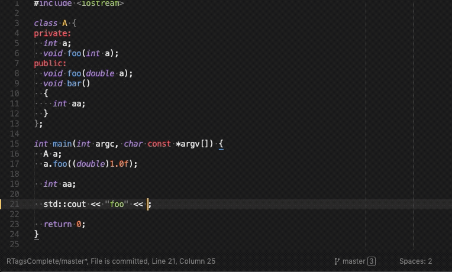

<p align="center" style="color: #999;font-family: Arial, sans-serif;font-size: 1.8em;font-weight: 900;text-align: center">
  
  RTagsComplete
</p>
Master [](https://travis-ci.org/tillt/RTagsComplete) Staging [](https://travis-ci.org/tillt/RTagsComplete)

# About

Sublime Text 3 C, C++ and Objective C code completion, navigation plugin based on [RTags](https://github.com/Andersbakken/rtags).

This is a fork of the original [sublime-rtags](https://github.com/rampage644/sublime-rtags) by Sergei Turukin. New features have been added and merging those back into the original sublime-rtags has become a bottleneck this fork avoids.

# Installation

Make sure you installed RTags - for all of the latest features, version 2.19 is the oldest we support. You will however get most functionality with RTags version 2.0 already.

### Via Package Control

- Install [Package Control](https://sublime.wbond.net/installation)
- Run “Package Control: Install Package”
- Install "RTagsComplete"

### Manually

    cd <sublime-text-Packages-dir>
    git clone https://github.com/tillt/RTagsComplete

# Features

## Symbol navigation (Goto definition/declaration)

Jump to the definition or declaration of a symbol.

## Find usages (Find symbol references, Find virtual function re-implementations)

Shows all references of the symbol under the cursor.


## Find unused functions

Finds and displays dead functions.

## Rename symbol

Allows to refactor symbols. Select a symbol with your cursor, activate the function and enter the new name.


## Find include

Finds the include file for the symbol under the cursor. If any are found, shows a quick panel that copies the selected include into the clipboard when hitting return.

## Symbol information

Shows a popup containing information about the symbol under the cursor.


## Code completion


## Code validation

Validates your current code and shows errors and warnings inline.



# Usage

## Typical work-flow

- [Make sure `rdm` is active](https://github.com/tillt/RTagsComplete/wiki/Make-sure-rdm-is-active).
- [Obtain compile_commands.json from the build chain of your project/s](https://github.com/tillt/RTagsComplete/wiki/Obtaining-compile_commands.json).
- [Supply rdm with compile_commands.json of your project/s](https://github.com/tillt/RTagsComplete/wiki/Supply-rdm-with-compile_commands.json).
- That's it - ready to code with ease.

# Default key bindings

Key bindings were originally inspired by Qt Creator.

+ Symbol navigation - `F2`
+ Find usages - `Ctrl+Shift+u`
+ Rename symbol - `Ctrl+Shift+Alt+u`
+ Find virtual function re-implementations - `Ctrl+Shift+x`
+ Symbol information - `Ctrl+Shift+i`
+ Use `Alt+/` explicitly for auto-completion
+ Mouse _button8_ to go backwards (mouse wheel left)
+ Error, fixit and warning navigation - `Ctrl-Shift-e`
+ Find unused functions - `Alt-Super-Shift-d`
+ Find include file for symbol - `Ctrl+i`
+ Show navigation history - `Ctrl+Shift+h`

# Customization

Customize your **Key Bindings** via *Preferences* > *Package Settings* > *RTagsComplete* > *Key Bindings* > *User*

Setup the plugin using your **User Settings** via *Preferences* > *Package Settings* > *RTagsComplete* > *Settings* > *User*

If you need **Auto Completion** add following to *Preferences* > *Settings* > *User*

```json
"auto_complete_triggers":
[
  {
    "characters": "<",
    "selector": "text.html"
  },{
    "characters": ".>: ",
    "selector": "source.c++.11, source.c++, source.c - string - comment - constant.numeric"
  }
]
```

# Further reading

For a typical setup of a larger codebase built via autotools, check out [Simplify development by adding RTags to your text editor](https://mesosphere.com/blog/simplify-development-by-adding-rtags-to-your-text-editor/).

# Credits

Original code by Sergei Turukin.
Hacked with plenty of new features by [Till Toenshoff](https://twitter.com/ttoenshoff).
Some code lifted from EasyClangComplete by Igor Bogoslavskyi.

On that thought, I would like to mention that EasyClangComplete is an excellent plugin, far more complex and in many ways superior to RTagsComplete. However, the approach taken by EasyClangComplete is arguably not so great for larger projects. EasyClangComplete aims to make things conveniently easy while RTagsComplete is attempting to offer plenty of features with highest possible performance at scale.
Maybe some day EasyClangComplete will be based on `clangd` and that is likely the day I stop tinkering with RTagsComplete.
