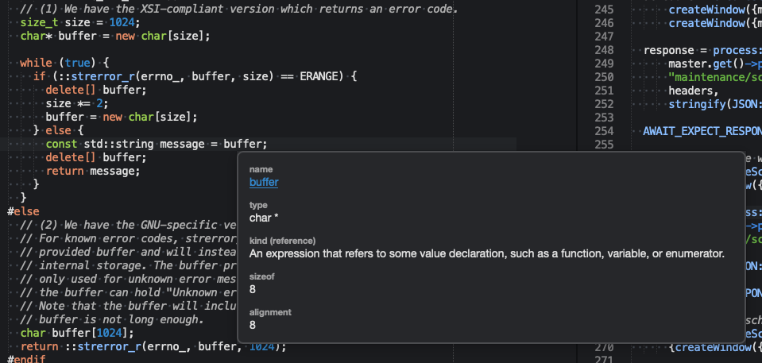

# RTagsComplete

Sublime Text 3 C/C++ code completion, navigation and validation plugin based on [RTags](https://github.com/Andersbakken/rtags).

# Features

- Symbol navigation (Goto definition/declaration)

- Find usages (Find symbol references, Find virtual function re-implementations, Find unused / dead functions)

- Symbol information

- Rename symbol

- Code completion

- Code validtion - shows errors and warnings inline

# Installation

### Install RTags

- *macOS*: `brew install rtags`
- *Linux*: [Installing RTags](https://github.com/Andersbakken/rtags#installing-rtags)
- *Windows*: [RTags is currently broken on Windows](https://github.com/Gei0r/rtags/blob/win/src/windows-todo.org) - please help getting it fixed

### Install this Plugin

- <kbd>CTRL</kbd>+<kbd>Shift</kbd>+<kbd>P</kbd> and install `RTagsComplete`

# Usage

- [Make sure `rdm` is active](https://github.com/tillt/RTagsComplete/wiki/Make-sure-rdm-is-active).
- [Obtain compile_commands.json from the build chain of your project/s](https://github.com/tillt/RTagsComplete/wiki/Obtaining-compile_commands.json).
- [Supply rdm with compile_commands.json of your project/s](https://github.com/tillt/RTagsComplete/wiki/Supply-rdm-with-compile_commands.json).
- That's it - ready to code with ease.
